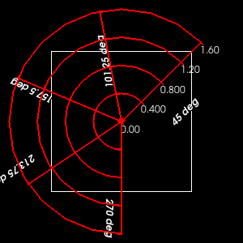
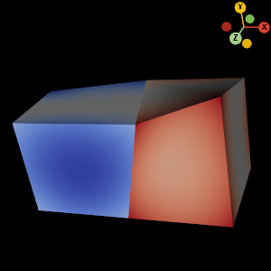
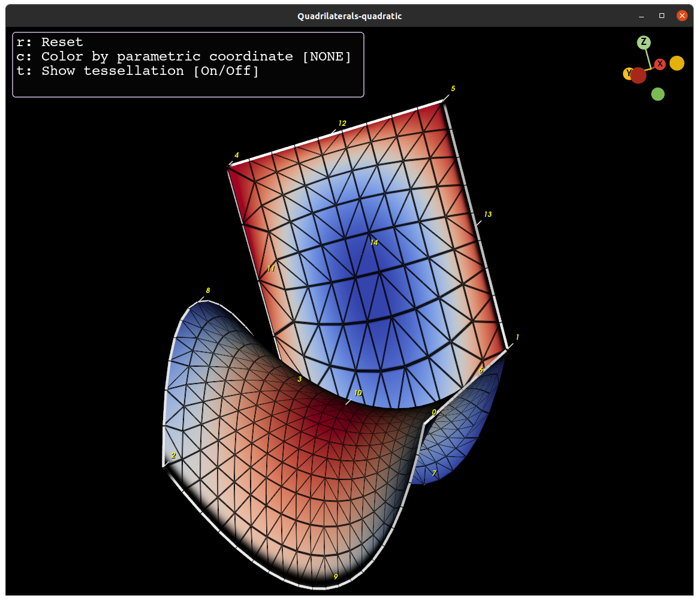

# VTK 9.4.1 Release Notes

Changes made since VTK 9.3.1 include the following.

----------------------------------------

<!-- vim-markdown-toc GFM -->

* [New Features](#new-features)
    * [Annotation](#annotation)
    * [DataModel](#datamodel)
    * [ExecutionModel](#executionmodel)
    * [Filters](#filters)
    * [Interaction](#interaction)
    * [I/O](#io)
    * [Python](#python)
    * [Rendering](#rendering)
    * [Testing](#testing)
    * [ThirdParty](#thirdparty)
    * [VR](#vr)
    * [WebAssembly](#webassembly)
    * [Wrapping](#wrapping)
* [Changes](#changes)
    * [Build](#build)
    * [DataModel](#datamodel-1)
    * [Filters](#filters-1)
    * [I/O](#io-1)
    * [Rendering](#rendering-1)
    * [Wrapping](#wrapping-1)
* [Fixes/improvements](#fixesimprovements)
    * [Accelerators](#accelerators)
    * [Annotation](#annotation-1)
    * [Build](#build-1)
    * [Charts](#charts)
    * [Core](#core)
    * [DataModel](#datamodel-2)
    * [Filters](#filters-2)
    * [I/O](#io-2)
    * [Interaction](#interaction-1)
    * [Python](#python-1)
    * [Rendering](#rendering-2)
    * [System](#system)
    * [VR](#vr-1)
* [Deprecations/Removals](#deprecationsremovals)

<!-- vim-markdown-toc -->

----------------------------------------

## New Features

### Annotation

- 💥 New `vtkPolarAxesActor2D` available for drawing a polar axes overlay.

    

### DataModel

- 💥 New `vtkImplicitArray` template class brings memory efficiency to vtk data array
    applications. [Author's note](./9.4/add-vtkImplicitArrays.md)
- The new `vtkAnnulus` implicit function represents an infinite annulus (two co-axial cylinders).
    [Author's note](9.4/annulus-implicit-widget.md)
- 💥 VTK now supports higher order Galerkin cells via a new data object `vtkCellGrid`. [Author's
    note](9.4/cell-grid-changes.md)

    

### ExecutionModel

- New information keys added to allow filters to execute without any prior temporal access for
    in-situ visualization. [Author's note](9.4/no-prior-temporal-access.md)

### Filters

- New `vtkAppendPartitionedDataSetCollection` class to append multiple partitioned dataset
    collections into a single partitioned dataset collection. [Author's note](9.4/add-append-PDC.md)
- New `vtkCriticalTime` filter to generate time step values based on user-specified threshold
    criteria. [Author's note](9.4/add-critical-time-threshold-filter.md)
- `vtkForceStaticMesh` is a new filter that allows assigning varying dataset attributes on a static
    geometry. [Author's note](9.4/add-ForceStaticMeshFilter.md)
- 💥 New filters `vtkForEach` and `vtkEndFor` allow logical pipeline execution over a
    `vtkExecutionRange`. [Author's note](9.4/add-ForEach.md)
- VTK now supports *spatio-temporal harmonics* data generation. [Author's note](9.4/add-harmonics-filter-source.md)

    
- `vtkHyperTreeGrid` dataset is now supported by a broader range of filters:
    - The `vtkRandomAttribute` generator now supports HTGs as input.
    - The `vtkGenerateIds` filter replaces the `vtkIdFilter` and now support `vtkHyperTreeGrid` in
      addition to `vtkDataSet`. The `vtkIdFilter` is now deprecated.
    - The dedicated `vtkHyperTreeGridGenerateProcessIds` filter has been added to generate process IDs.
    - The dedicated `vtkHyperTreeGridGenerateGlobalIds` filter has been added to generate global IDs.
- Feature edges detection is now supported for `vtkHyperTreeGrid` datasets via the new
    `vtkHyperTreeGridFeatureEdges` filter.
- `vtkHyperTreeGridProbeFilter` obtained a `UseImplicitArray` option that makes the filter use
    indexed arrays to lower memory consumption, albeit with higher computational cost.
- New `vtkDataObjectMeshCache` allows storing and reusing `vtkDataSet` and subclasses. [Author's
    note](9.4/add-static-mesh-cache.md)
- New `vtkTemporalSmoothingFilter` averages input scalar values over a temporal window.
- Introduced `vtkBatch` that provides multithreading to improve vtkAlgorithm performance. [Author's
    note](9.4/add-vtkBatch-and-improve-table-based-clip.md)
- A new `vtkGoldenBallSource` algorithm has been added to create a solid tetrahedralized ball.
    [Author's note](9.4/filters-sources-ball.md)

### Interaction

- The `vtkRenderWindowInteractor::InteractorManagesTheEventLoop` flag can be used to integrate a VTK
    interactive application within an external event loop. [Author's
    note](9.4/add-InteractorManagesTheEventLoop-flag.md)
- `vtkBoxRepresentation` has a new `SetCorners`/`GetCorners` to control 3D coordinate bounds of the
    `vtkBoxWidget`.
- Using the option `RectangularShape` on the `vtkFinitePlaneRepresentation` for the
    `vtkFinitePlaneWidget`, the widget stays rectangular when moving the two control points.
- The vtkCaptionRepresentation can now be sized using a configurable API `SetFit`. The two options
    available to the user are `VTK_FIT_TO_BORDER` and `VTK_FIT_TO_TEXT`.
- The new `vtkImplicitConeWidget` represents an infinite cone parameterized by an axis, and angle
    between the sides of the cone and its axis, and an origin point.

### I/O

- New `vtkBTSReader` for reading Engys' HELYX and ELEMENTS format data.[Author's
    note](9.4/add-BTSReader.md)
- New `vtkERFReader` can be used to read ERF HDF5 files into a VTK application. [Author's
    note](9.4/add-ERFReader.md)
- New `vtkFDSReader` for reading data produced by [Fire Dynamics
    Simulator](https://pages.nist.gov/fds-smv/). [Author's note](9.4/add-FDSReader.md)
- The `vtkXdmfReader` now supports arbitrary polyhedra cell types. [Author's
    note](9.4/add-support-for-arbitrary-polyhedra-to-Xdmf2.md)
- `vtkCGNSReader` is a new reader for CGNS files produced by the CONVERGE CFD (*.cgns).
- `vtkHDFWriter` is a new writer that supports most VTK datasets including temporal and composite
    data to the VTKHDF file format. [Author's note](9.4/add-vtkHDFWriter.md)
- The new `vtkAlembicExporter` exports the current view to the [Alembic file
    format](https://www.alembic.io) ".abc" file. [Author's note](9.4/alembic-exporter.md)
- The `vtkFLUENTReader` is now also able to read FLUENT mesh files (*.msh).

### Python

- 💥 VTK now supports a more pythonic style object construction via property arguments. [Author's
    note](9.4/add-property-initialization-for-vtk-class-from-python-constructor.md)
- 💥 The pythonic API support is also extended to connecting pipelines. [Author's
    note](9.4/new-python-api-for-pipelines.md)
- In `dataset_adapter`, CompositeDataset can now access `GlobalData`, i.e. the `FieldData` of its
    root.
- VTK now provides wheels using EGL for rendering available from the [VTK Package
    Registry].
- VTK now provides Python 3.13 wheels available from PyPI and the [VTK Package Registry].
- Added a new `AddUserPythonPath` static method for `vtkPythonInterpreter` that can be used to add
    user python paths.

[VTK Package Registry]: https://gitlab.kitware.com/vtk/vtk/-/packages

### Rendering

- 💥 New ANARI rendering backend available via the `vtkRenderingANARI` module. [Author's
    note](9.4/add-anari-rendering-capability.md)
- VTK now loads the appropriate OpenGL library at runtime using `glad` and no longer provides the
    `VTK::opengl` module. [Author's note](9.4/support-runtime-opengl-window-selection.md)
- New ability to choose graphics backend preference for WebGPU via `SetBackendType`.[Author's
    note](9.4/add-graphics-backend-preference-for-webgpu-rendering.md)
- The `vtkCellGridMapper` now supports hardware selection to pick actors mapping `vtkCellGrid`
    datasets. The selection nodes provide additional properties like type of cell selected.
- 💥 VTK now supports OpenGL tessellation shaders. [Author's
    note](9.4/add-opengl-tessellation-shader-support.md)
- VTK now renders `vtkCellGrid` instances with upto quadratic geometry using dynamic distance-based
    tessellation shaders.

    
- The new `vtkOpenGLLowMemoryPolyDataMapper` is the default factory override for `vtkPolyDataMapper`
    when `VTK_OPENGL_USE_GLES=ON`.
- `vtkArrayRenderer` is a new mapper to prototype OpenGL shader code using `vtkDataArray` bound to
    texture buffers. [Author's note](9.4/array-renderer.md)
- A new alternative tone mapping method has been added to `vtkToneMappingPass` based on the
    reference implementation of Khronos PBR Neutral.
- 💥 New compute shader API allows offloading work from the CPU to the GPU using webGPU compute
    shaders.
- The new `vtkWebGPUComputeFrustumCuller` culls actors to the camera frustum using webGPU
    compute shaders.
- The new `vtkWebGPUComputeOcclusionCuller` uses the compute API for hierarchical two-pass occlusion
    culling. [Author's note](9.4/webgpu-occlusion-culler.md)
- The new `vtkWebGPUComputePointCloudMapper` is a webGPU compute shader implementation based on the
    paper from [Shütz et.
    al.](https://www.cg.tuwien.ac.at/research/publications/2021/SCHUETZ-2021-PCC/).
- 💥 VTK now supports zSpace Inspire devices via the new `vtkZSpaceWin32RenderWindow` and
    `vtkZSpaceGenericRenderWindow`.

### Testing

- 💥 New image testing framework using the Structural Similarity Index (SSIM). [Author's
    note](9.4/image-testing-framework.md)

### ThirdParty

- New `VTK::catalyst` module added to support Catalyst directly. [Author's
    note](9.4/add-catalyst-module.md)

### VR

- VTK now supports a collaboration mode when rendering across multiple CAVE systems. [Author's note](9.4/hmd-cave-collaboration.md)
- VTK OpenXR module supports depth information to allow hologram stability on augmented reality
    devices like Microsoft Hololens 2.
- VTK now supports basic rendering of controller models under OpenXR. [Author's note](9.4/support-openxr-controller-models.md)

### WebAssembly

- 💥 The new `vtkWebAssemblyOpenGLRenderWindow` and `vtkWebAssemblyRenderWindowInteractor` use
    Emscripten HTML5 API for event handling bringing in wasm64 and web-worker support.
- You can now enable 64-bit in VTK wasm build with the `VTK_WEBASSEMBLY_64_BIT` CMake option.
- You can now enable multithreading in VTK wasm build with the `VTK_WEBASSEMBLY_THREADS` option.
- The new `vtkRemoteInteractionAdapter` maps *vtk-js* interaction events to vtk in the form of a
    json-formatted string applied to `vtkRenderer`.

### Wrapping

- VTK now auto generates (de)serialization code in C++ for classes annotated by the
    `VTK_MARSHALAUTO` wrapping hint.
- The new `vtkObjectManager` class allows applications to track the state of marshallable classes.

## Changes

### Build

- ABI mangling using `inline namespace` in VTK has matured with better guards and a CI build to
    catch issues. :warning: **BREAKING_CHANGES** [Author's note](9.4/abi-mangling-extension.md)
- ‼️ Some function-like macros now require trailing semi-colons. [Author's note](9.4/macro-semi-colons.md)
- `vtkThreadedTaskQueue` and `vtkThreadedCallbackQueue` have been moved from the Parallel/Core
    module to the Common/Core module to stay consistent with other SMP related tools.
* The `_vtk_module_depfile_args` internal command is now available to compute
    `add_custom_command(DEPFILE)` arguments based on the CMake version and generator.
- The `_vtk_module_add_file_set` internal API has been added to add file
    sets to targets in a CMake-version portable way.
- The `vtk_module_build` API has learned a new `USE_FILE_SETS` API to control the
    usage of file sets for projects that are not yet ready to use them.
- The `vtk_module_link` CMake module API learned the `NO_KIT_EXPORT_IF_SHARED`
    argument to prevent exporting of mentions of imported targets coming from a
    `vtk_module_find_package(PRIVATE_IF_SHARED)` call.
- The `vtk_object_factory_configure` CMake API now supports an
    `INITIAL_CODE_FILE` argument to avoid having to get arbitrary source through CMake's argument
    parser.
- `vtkVersionQuick` header now has a new `VTK_EPOCH_VERSION` macro defined as the actual
    `VTK_BUILD_VERSION` value for release-track development.

### DataModel

- Some of the `vtkDataSet` subclasses now make use of `vtkStructuredPoints`, `vtkStructuredCells` to
    improve vtk performance. [Author's note](9.4/add-structured-points-cells-cellTypes.md)
- You can now force a value type for the `ValueRange` of a generic data array and access the pointer
    via `ValueRange::data()`. This allows dynamic type casting for unknown `vtkDataArray` types.
- `vtkDataArray` tuple access can now allows for 64-bit integer data via
    `SetIntegerTuple`/`GetIntegerTuple`. [Author's note](9.4/array-api.md)
- `vtkCellArray` default storage type is now configurable at runtime via
    `SetDefaultStorageIs64Bit()`.

### Filters

- The `vtkHyperTreeGridThreshold` now exposes a `SetMemoryStrategy` method for choosing the
    structure of its output in memory. [Author's note](9.4/add-MemoryStrategiesHTGThreshold.md)
- More `vtkAbstractTransform` subclasses ported to use `vtkSMPTools` acceleration. [Author's
    note](9.4/add-more-SMP-transforms.md)
- You can now use the input array magnitude values for thresholding data with `vtkThreshold` by
    setting the component mode - `SetComponentModeToUseSelected`.
- The `vtkDecimatePolylineFilter` has been refactored to use a strategy pattern for decimation.
    [Author's note](9.4/add-new-polyline-decimation-strategies.md)

### I/O

- `vtkHDFReader` now supports composite datasets like `vtkPartitionedDataSetCollection`,
    `vtkMultiBlockDataSet` and temporal overlappingAMR based on user specified parameters.
- The `vtkHDFReader` and `vtkIOSSReader` gained a new caching parameter to enable/disable caching
    temporal data from time-series datasets.
- `vtkFidesReader` has a new `CreateSharedPoints` parameter to create shared points at the interface
    between blocks of uniform grids. It can also choose which arrays to load.
- The `vtkFLUENTReader` introduced loading zones from the FLUENT .msh files. :warning:
    **BREAKING_CHANGES** [Author's note](9.4/add-fluent-reader-zones-support.md)
- `vtkXMLWriterBase` subclasses can now choose to write `TimeValue` field data with
    `SetWriteTimeValues()`.
- `vtkCityGMLReader::SetField` methods allow setting texture paths or material colors for polydata
    in a multiblock dataset.
- The `vtkADIOS2VTXReader` has improved error reporting and build changes. [Author's
    note](9.4/adios2-vtx-reader-changes.md)
- Added support for AMReX-based simulation codes to pass data to ParaView Catalyst. [Author's
    note](9.4/catalyst2-amr-support.md)
- `vtkCesium3DTilesReader` has been extended support additional features. :warning:
    **BREAKING_CHANGES** [Author's note](9.4/improve-vtkCesium3DTilesReader.md)
- `vtkGLTFExporter` now has a configurable API for whether to export NaN color or not.

### Rendering

- `vtkOpenGLPolyDataMapper2D` now supports custom uniforms set using the `vtkShaderProperty` for a
    `vtkActor2D`.
- One can now specify `vtkImageData` geometry (origin, spacing, axis directions) from a 4x4 matrix
    using the new `ApplyIndexToPhysicalMatrix` and `ApplyPhysicalToIndexMatrix` methods.
- `vtkWebAssemblyRenderWindowInteractor` and `vtkSDL2OpenGLRenderWindow` classes now support hi-dpi
    screens.
- The `vtkUnstructuredGridGeometryFilter::MatchBoundariesIgnoringCellOrder` option allows disabling
    interior faces of different order cells in polyhedral meshes. [Author's
    note](9.4/add-MatchBoundariesIgnoringCellOrder.md)
- `vtkWebGPURenderWindow` supports switching power preference via
    `PreferHighPerformanceAdapter()`/`PreferLowPowerAdapter()`.
- `vtkXWebGPURenderWindow` is now the default factory override for `vtkRenderWindow` when using the
    experimental WebGPU backend on Linux desktops.
- `vtkShaderProgram` now supports OpenGL compute shaders.
- SDL2 has been disabled by default and new WebAssembly classes are recommended. [Author's
    note](9.4/disable-sdl2-by-default.md)
- `vtkExtractSelection` can now skip hidden points/cells using the `TestGhostArrays` option. It has
    also been fixed to work for `vtkUniformGridAMR` subclasses.
- `vtkScalarBarActor` now supports a `vtkPiecewiseFunction` as a scalar opacity function in addition
    to the color lookup table.
- `vtkOpenGLRenderWindow` now allows to blit the depth buffer as well as set the depth buffer bit
    size of render buffers for working in external OpenGL context environments.

### Wrapping

- VTK's wrapping tools now support depfile output via the `-MF` flag.
- `vtkWrap_WarnEmpty` is now available to warn when empty bindings are generated.

## Fixes/improvements

### Accelerators

- Changed the VTK to VTK-m array conversion routines. [Author's
    note](9.4/corrected-vtk-vtkm-transfers.md)

### Annotation

- `vtkAxisActor2D`'s tick and label positioning has been improved.

### Build

- Optional dependencies now have better logic for detecting the usability of external optional
     dependencies.
- Building packages against static VTK libraries with the MSVC compiler no longer fails due to a
     missing symbol for `vtkSMPToolsImpl::IsParallelScope`.

### Charts

- `vtkChartLegend` can now specify the anchor point in normalized point coordinates to preserve
    across chart resizes.

### Core

- New `vtkSMPTools::GetEstimatedDefaultNumberOfThreads` available to introspect the default number
    of threads that SMP tasks will use.
- `vtkStringToken` has been moved to a third-party library (`ThirdParty/token`). [Author's
    note](9.4/string-token-fix.md)

### DataModel

- `vtkCone` now exposes getters and setters for its axis and origin parameters.
- Fixed normal computation in the `vtkCell::GetFace` method for 3D cells.
- `vtkCell` triangulation api was refactored to improve performance and reduce code redundancy.
    [Author's note](9.4/refactor-vtkCell-triangulate.md)
- `vtkPolygon` triangulation implementation has been improved. [Author's note](9.4/vtkPolygons-quad-triangulation-quick-path.md)
- Multiple improvements to VTK's polyhedral cell storage. [Author's note](9.4/vtk-polyhedral-cells-storage.md)
- Fix cell-grid initialization crashing on static debug Windows builds. [Author's note](9.4/cell-grid-initialization.md)

### Filters

- `vtkUnstructuredGrid::InsertFace` is improved slightly by avoiding duplicate point searches.
- The `vtkConduitSource` has been updated to use `vtkDataObject` API and it has been improved to
    output field data at the leaf level of the `vtkPartitionedDataSet`.
- Fixed `vtkMergeArrays` for temporal data.
- Improved the `vtkOrientPolyData` seed face cell selection algorithm.
- `vtkReflectionFilter` supports the `VTK_PIXEL` cell type.
- Fixed scaling error in `vtkWindowdSincPolyDataFilter`. [Author's note](9.4/fix-windowedsinc-scaling-error.md)
- `vtkGhostCellsGenerator` can now generate points/cells global and process ids.
- `vtkIntegrateAttributes` has been multithreaded using vtkSMPTools.
- `vtkRedistributeDataSetFilter` was refactored for better modularity. :warning:
    **BREAKING_CHANGES** [Author's note](9.4/refactor-vtkRedistributeDataSetFilter.md)
- Optimized `vtkUnstructuredGridGeometryFilter` for higher order as well as degenerate cells. [Author's note](9.4/speed-vtkUnstructuredGridGeometryFilter.md)
- Refactored `vtkPolyDataNormals` for better code concurrency. [Author's note](9.4/split-vtkPolyDataNormals.md)
- `vtkDataSetSurfaceFilter` now supports non-linear cells for the subdivision algorithm.

### I/O

- `vtkDelimitedTextReader` has a much lower memory consumption overhead and gained performance
    improvements. [Author's note](9.4/delimited-text-reader-performances.md)
- `vtkEnsightGoldCombinedReader` and `vtkEnsightSOSGoldReader` have been rewritten for better
    overall functionality. [Author's note](9.4/ensight-gold-rewrite.md)
- The `vtkFDSReader` now correctly supports reading slice & boundaries files (.sf & .bf),
    for both point and cell-centered data.
- `vtkIOSSReader` has been fixed for 21-node wedge and 18-node pyramid cells. It has also been
    refactored for performance improvements and code readability.

### Interaction

- Multiple improvements have been made to the multi-touch event based gesture handling in VTK.
    :warning: **BREAKING_CHANGES** [Author's note](9.4/multitouch-gestures.md)
- Fixed Cocoa (macOS) incorrect KeySym. [Author's note](9.4/cocoa-backspace-keysym.md)

### Python

- Better support for single char parameters in vtk functions via python. [Author's
    note](9.4/python-char-length.md)
- Improved python concurrency via wrapper hints. [Author's note](9.4/python-hint-unblock.md)
- Logic to enable module import at vtk module load time. [Author's note](9.4/python-numpy-integration.md)

### Rendering

- `vtkShadowMapBakerPass` exposes setters and getters for `ExponentialConstant` used in the
    exponential shadow maps algorithm for shadow rendering.
- Fixed rendering lines as tubes without lighting with the `vtkOpenGLPolyDataMapper`.
- Scalar coloring has been fixed for the `vtkCompositePolyDataMapper`.
- Ensure that the `vtkHardwarePicker` returns the ID from the closest node.
- Fixed blending issues with the `vtkOrderIndependentTranslucentPass`.
- `vtkLegendScaleActor` improvements. [Author's note](9.4/legend-scale-actor.md)
- On Linux (and any platform that uses GLX for OpenGL), VTK will now ask
    for `GLX_CONTEXT_PROFILE_MASK_ARB` and `GLX_CONTEXT_CORE_PROFILE_BIT_ARB` when creating a
    rendering context.
- Infinite floor plane support in VTK via `vtkSkybox`. [Author's note](9.4/skybox-floor-projection.md)

    

- Fix deserialization bug in vtkCollection. [Author's note](9.4/fix-deserialization-bug-in-vtkCollection.md)
- Fixed backface color in glyph 3D mapper. [Author's note](9.4/fix-backface-color-for-glyph3d-mapper.md)
- Fixed X error about maximum clients reached. [Author's note](9.4/fix-x-error-maximum-clients-reached.md)
- Fixed bug with removing and adding vtkOrientationMarkerWidget. [Author's note](9.4/fix-vtkOrientationMarkerWidget-remove-and-add-bug.md)

### System

- `vtkSocket` can now bind to any user-specified address to restrict interfaces the
    `vtkServerSocket` can be accessed from.

### VR

- Improved head-mounted display tracking in `vtkVRRenderWindow`. [Author's note](9.4/vr-viewfrustum.md)
- Add explicit support for PHYSICAL and WORLD coordinate systems via the 4x4 matrix -
    `PhysicalToWorldMatrix`.

## Deprecations/Removals

- Python 3.6 and 3.7 are end-of-life. VTK 9.4 dropped official support for it from CI and wheel
    builds.

The following APIs were deprecated in 9.2 or earlier and are now removed:

- `vtkObjectBase`'s `Register` is no longer virtual. To control
  register counting/garbage collecting behavior override
  `vtkObjectBase::UsesGarbageCollector` instead. The following classes have
  been changed to meet this requirement:
  - `vtkInformationKey`
  - `vtkGarbageCollectorImpl`
- `vtkOpenFOAMReader::SetDecomposePolyhedra` has been removed.
- `vtkCriticalSection` has been removed (use `std::mutex` instead).
- `vtkHierarchicalBoxDataIterator` class removed. Use
  `vtkUniformGridAMRDataIterator` instead.
- `vtkHyperTreeCursor` class removed. Use other Hyper Tree Grid cursors
  instead.
- The following classes have been removed in favor of `vtkExtractSelection`:
  - `vtkExtractSelectedBlock`
  - `vtkExtractSelectedIds`
  - `vtkExtractSelectedLocations`
  - `vtkExtractSelectedPolyDataIds`
  - `vtkExtractSelectedThresholds`
- `vtkCompositeInterpolatedVelocityField` replaces the following classes:
  - `vtkCachingInterpolatedVelocityField`
  - `vtkCellLocatorInterpolatedVelocityField`
  - `vtkInterpolatedVelocityField`
- `vtkAbstractCellLocator` has the following members removed for thread safety:
  - `SetLazyEvaluation`
  - `GetLazyEvaluation`
  - `LazyEvaluationOn`
  - `LazyEvaluationOff`
- `vtkCellLocator::BuildLocatorIfNeeded` removed because LazyEvaluation has
  been deprecated.
- `vtkCellTree::BuildLocatorIfNeeded` removed because LazyEvaluation has been
  deprecated.
- `vtkInteractorEventRecorder::ReadEvent()` has been moved to
  `ReadEvent(const std::string&)`.
- `vtkHyperTreeGrid::GetNumberOfVertices` deprecated in favor of
  `GetNumberOfCells()`.
- `vtkVRCamera`'s `GetTrackingToDCMatrix` removed. Use
  `GetPhysicalToProjectionMatrix` instead.
- `vtkTemporalInterpolatedVelocityField`
  - `SetDataSetAtTime` removed, use `SetMeshOverTime` instead.
  - `IsStatic` removed, use `GetMeshOverTime` instead.
- `vtkParticleTracerBase`
  - `SetStaticMesh` removed, use `SetMeshOverTime` instead.
  - `GetStaticMesh` removed, use `GetMeshOverTime` instead.
- `vtkTableFFT`'s `PrefixOutputArrays` has been deprecated in favor of always
  keeping the output array names the same as the input.
- `vtkGeometryFilter`'s `SetDegree`, `GetDegreeMinValue`, `GetDegreeMaxValue`,
  `GetDegree`, `SetLocator`, `GetLocator`, and `CreateDefaultLocator` have been
  removed.
- `vtkCellTypes` location information has been removed:
  - `SetCellTypes(vtkIdType ncells, vtkUnsignedCharArray* cellTypes, vtkIdTypeArray* cellLocations)`
    use version `SetCellTypes` without `cellLocations` instead.
  - `GetCellLocation` removed.
- `vtkStaticCellLocator` no longer uses `Tolerance` which has deprecated the
  `UseDiagonalLengthTolerance` flag.
- `vtkDescriptiveStatistics`'s `UnbiasedVariance`, `G1Skewness`, and
  `G2Kurtosis` parameters have been removed. Use `SampleEstimate` instead.
- `vtkBorderRepresentation::SetBWActorDisplayOverlay` is deprecated. Use Set
  `BWActorDisplayOverlayEdges` or `SetBWActorDisplayOverlayPolygon` instead.
- `vtkOSPRayRendererNode`'s `VolumeAnisotropy` parameter has been removed.
- `vtkMeshQuality` has removed the following flags:
  - `Volume`
  - `CompatibilityMode`
- Removed `_InteractionState` typedef from the following classes:
  - `vtkQWidgetRepresentation`
  - `vtkAffineRepresentation`
  - `vtkBalloonRepresentation`
  - `vtkBorderRepresentation`
  - `vtkButtonRepresentation`
  - `vtkCompassRepresentation`
  - `vtkContinuousValueWidgetRepresentation`
  - `vtkCoordinateFrameRepresentation`
  - `vtkCurveRepresentation`
  - `vtkDisplaySizedImplicitPlaneRepresentation`
  - `vtkFinitePlaneRepresentation`
  - `vtkHandleRepresentation`
  - `vtkImplicitCylinderRepresentation`
  - `vtkImplicitPlaneRepresentation`
  - `vtkMagnifierRepresentation`
  - `vtkParallelopipedRepresentation`
  - `vtkPointCloudRepresentation`
  - `vtkRectilinearWipeRepresentation`
  - `vtkSliderRepresentation`
  - `vtkVRPanelRepresentation`
- Removed `_WidgetState` typedef from the following classes:
  - `vtkQWidgetWidget`
  - `vtkAffineWidget`
  - `vtkAxesTransformWidget`
  - `vtkBorderWidget`
  - `vtkBoxWidget2`
  - `vtkButtonWidget`
  - `vtkCameraPathWidget`
  - `vtkCenteredSliderWidget`
  - `vtkCompassWidget`
  - `vtkContinuousValueWidget`
  - `vtkCoordinateFrameWidget`
  - `vtkDisplaySizedImplicitPlaneWidget`
  - `vtkFinitePlaneWidget`
  - `vtkHandleWidget`
  - `vtkImplicitCylinderWidget`
  - `vtkImplicitPlaneWidget2`
  - `vtkLineWidget2`
  - `vtkMagnifierWidget`
  - `vtkPointCloudWidget`
  - `vtkPolyLineWidget`
  - `vtkRectilinearWipeWidget`
  - `vtkResliceCursorWidget`
  - `vtkSliderWidget`
  - `vtkSphereWidget2`
  - `vtkSplineWidget2`
  - `vtkTensorWidget`
  - `vtkVRMenuWidget`
  - `vtkVRPanelWidget`
- Removed `_HighlightState` typedef from `vtkButtonRepresentation`.
- Removed `_Picking_Mode` typedef from `vtkPointCloudRepresentation`.
- Removed `_SliderShape` typedef from `vtkSliderRepresentation3D`.
- `vtkChemistryConfigure.h` has been removed.
- `vtkMFCConfigure.h` has been removed.
